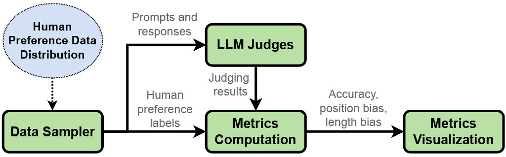
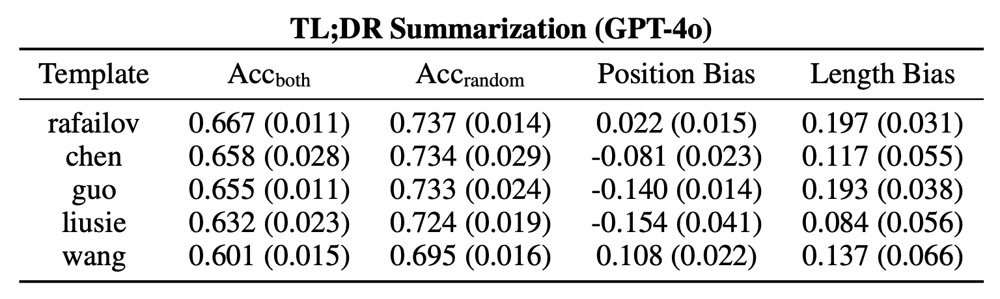
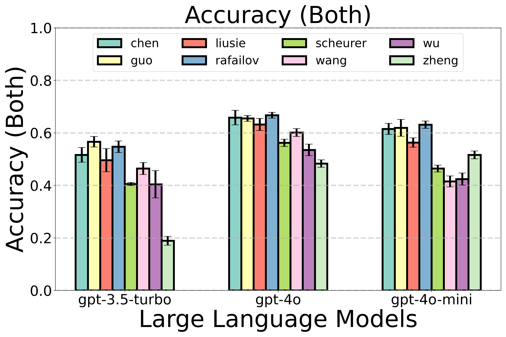
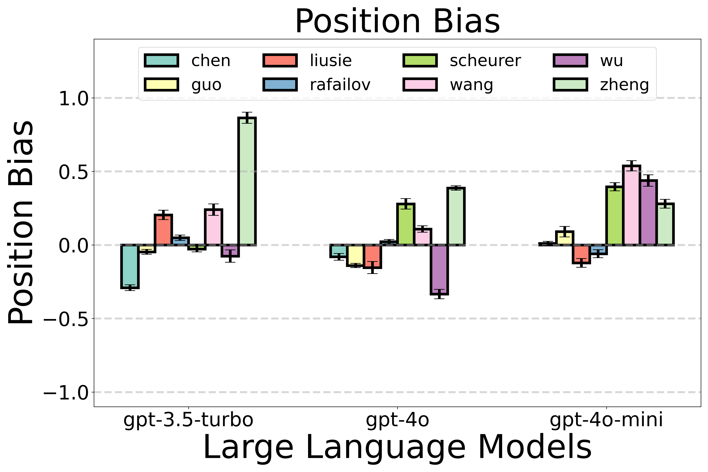
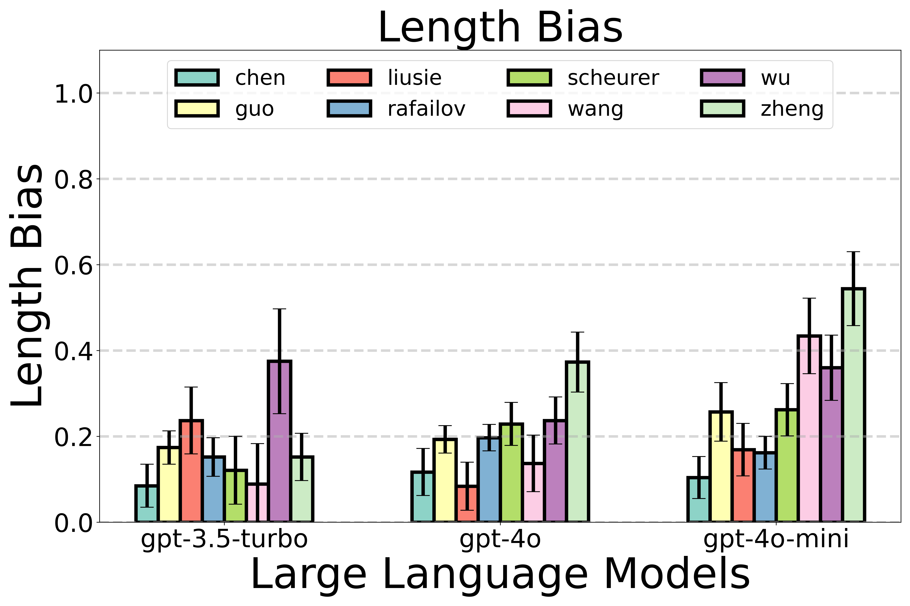
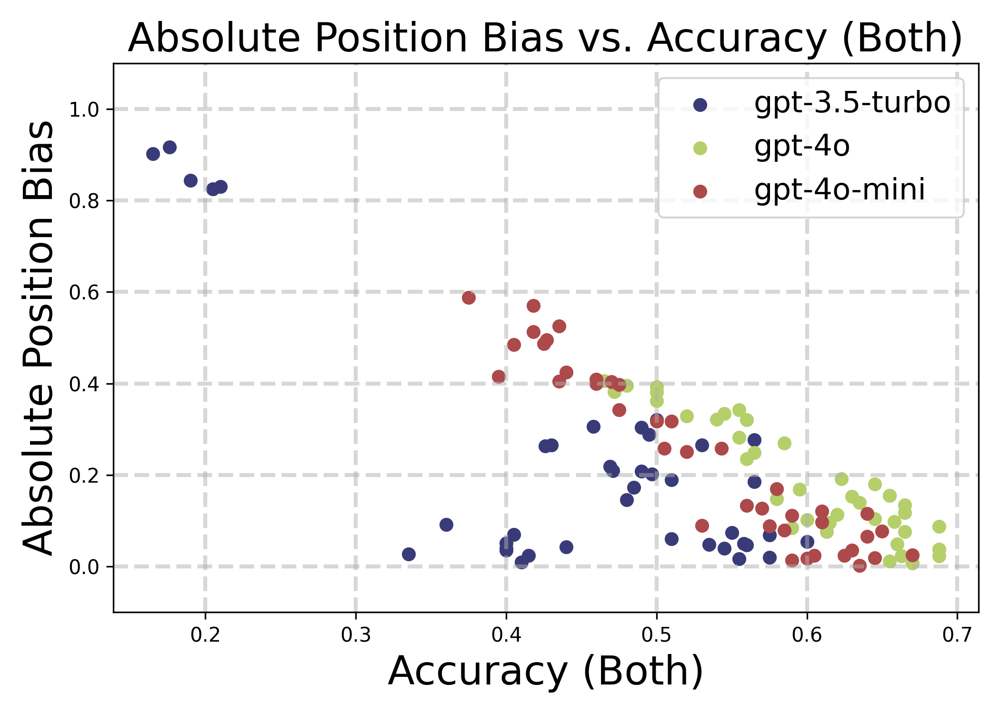

## Systematic Evaluation of LLM-as-a-Judge in LLM Alignment Tasks: Explainable Metrics and Diverse Prompt Templates

### Introduction

This repository contains code for our paper _Systematic Evaluation of LLM-as-a-Judge in LLM Alignment Tasks: Explainable Metrics and Diverse Prompt Templates_. \[[arXiv](https://arxiv.org/pdf/2408.13006)\]



In this work, we systematically evaluate LLM-as-a-Judge methodology on two LLM alignment datasets (i.e `TL;DR Summerization` and `HH-RLHF-Helpful`):

- we define evaluation metrics with improved theoretical interpretability.
- we develop a framework to evaluate, compare, and visualize the reliability and alignment of LLM judges.
- we investigate the effect of diverse prompt templates on LLM-judge reliability.
- our results indicate a significant impact of prompt templates on LLM judge performance, as well as a mediocre alignment level between the tested LLM judges and human evaluators.

### Package installation

Run the following command to install the required Python packages.

```bash
# The python environment has been tested on python=3.8, 3.8.19, 3.9.6
pip install -r requirements.txt
```

Then set the Python path to the current directory.

```bash
export PYTHONPATH=$PYTHONPATH:$(pwd)
```
If you want to use use a different LLM provided exposing OpenAI compatible API, you can define the `OPENAI_API_KEY` environment variable. For example with server from LM Studio running on port 1234:

```bash
export OPENAI_BASE_URL="http://localhost:1234/v1"
```


### Dataset Preprocessing

Use the following command to prepare a formatted dataset for the LLM judge evaluation process.
The default dir to save the processed dataset `./datasets/formatted_datasets`.
The `dataset_id` identifies the formatted dataset, which is better kept consistent in the following steps.
For example:

```bash
python datasets/data_preprocessing.py \
--data-path datasets/raw_datasets/ \
--output-dir datasets/formatted_datasets/ \
--dataset-id summarize
```

For more options, run `python datasets/data_preprocessing.py -h`.

### Add OpenAI Key

Add your own OpenAI key to `configs/openai_api_key.py` in order to evaluate LLM judges.

### Evaluate a Set of LLM Judges by Metric Computation and Visualization

Use the example below to evaluate a set of LLM judges using the example dataset `dataset_id=summarize`.
The templates are specified in `templates/dataset_id` folders. For example:

```bash
python eval/eval_llm_judges.py \
  --processed_data_path ./datasets/formatted_datasets/summarize/data.summarize.xxxx_xx_xx.jsonl \
  --dataset_id summarize \
  --split_size 200 \
  --num_splits 5 \
  --self_consist_id 0 \
  --num_runs 5 \
  --num_eval -1 \
  --models "['gpt-4o-mini']" \
  --templates "['chen-2023_summarize', 'guo-2024_summarize']" \
  --extract_rule combine \
  --temperature 0.1 \
  --num_workers 8 \
  --use_cache_samples \
  --use_cache_results \
  --cache_dir ./outputs/
```

Run `python eval/eval_llm_judges.py -h` to see all the available options.

### Example Evaluation Results

#### Metric Report Tables

Metric report tables related to evaluating LLM judges (`model:GPT-4o` with different templates) on the `TL;DR Summarization` dataset.

<div style="display: grid; grid-template-columns: repeat(1, 1fr); gap: 2px; text-align: center;" >
  <div>
    
  </div>
</div>

#### Visualization Results

Visualization results related to evaluating LLM judges (models + different templates) on the `TL;DR Summarization` dataset.\
   
   

### References

```
@article{wei2024systematic,
  title={Systematic Evaluation of LLM-as-a-Judge in LLM Alignment Tasks: Explainable Metrics and Diverse Prompt Templates},
  author={Wei, Hui and He, Shenghua and Xia, Tian and Wong, Andy and Lin, Jingyang and Han, Mei},
  journal={arXiv preprint arXiv:2408.13006},
  year={2024}
}
```
